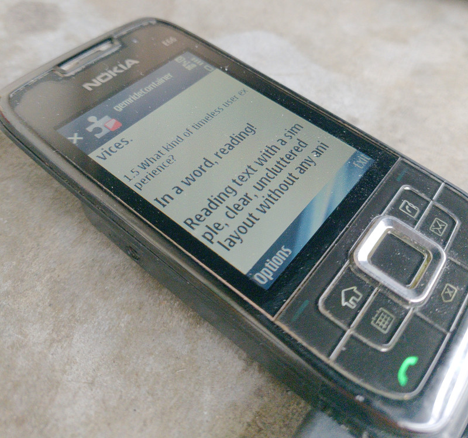

# gemride

[Gemini protocol](https://geminiprotocol.net/) browser for Symbian S60 3rd Edition FP2.

## Features

- Gemtext rendering: headings, links, quotes, preformatted, word-wrap
- TLS
- Link navigation
- Retry-on-failure
- Fullscreen mode (press `*`)

## Installation

Direct links: [signed](https://github.com/droserasprout/gemride/raw/refs/heads/master/sis/gemride.sisx) | [unsigned](https://github.com/droserasprout/gemride/raw/refs/heads/master/sis/gemride.sis)

## Build environment

Nokia E66 is the only Symbian phone I possess at the moment, so there's only one "success path" described in details below. This setup lets you do development on Linux and "hot reload" builds in VM.

### Device preparation

**TODO**: Symbian jailbreak, TLS patch, TRK debug

### VM preparation

- Install VirtualBox
- Create new VM, install Windows 7 SP1 (Eagle123 build with offline updates to 2024-01; vanilla + Legacy Update breaks Nokia PC Suite)
- Install the toolchain stack from the table below (Carbide 2.7, S60 3rd FP2 SDK v1.1, ActivePerl 5.6.1, CSL ARM 2005-Q1C, Nokia PC Suite 7.1)
- Install VirtualBox Guest Additions (enables shared folders and `VBoxManage guestcontrol`)
- Add a shared folder pointing at the Linux project dir, mounted as `Y:` with auto-mount + permanent
- Copy (mirror) `C:\S60\` into `Y:\S60\` so project and SDK share a drive
- Set a non-blank password on the auto-created `user` account (`net user user <pw>` from an elevated cmd) so `VBoxManage guestcontrol` and TRK auth work — blank-password accounts are blocked for non-console logons by default

### Software versions

tldr: Carbide 2.7, S60 3rd FP2 SDK v1.1, ActivePerl 5.6.1, CSL ARM 2005-Q1C, Nokia PC Suite 7.1

| Name | Version |
| --- | --- |
| ActivePerl 5.6.1 Build 635 | 5.6.635 |
| Carbide.c++ v2.7 | 2.70.0000 |
| CSL ARM Toolchain (arm-symbianelf) 2005-Q1C | 2005-Q1C |
| Git | 2.46.2 |
| MSVC90_x64 | 1.0.1.2 |
| MSVC90_x86 | 1.0.1.2 |
| Nokia Connectivity Cable Driver | 7.1.69.0 |
| Nokia PC Suite | 7.1.180.64 |
| Oracle VirtualBox Guest Additions 7.2.4 | 7.2.4.170995 |
| PC Connectivity Solution | 11.5.29.0 |
| PowerShell 7-x64 | 7.2.24.0 |
| S60 3rd Edition SDK for Symbian OS, Feature Pack 2 v1.1 | 1.00.0000 |
| Windows Driver Package - Nokia Modem  (02/25/2011 4.7) | 02/25/2011 4.7 |
| Windows Driver Package - Nokia Modem  (02/25/2011 7.01.0.9) | 02/25/2011 7.01.0.9 |
| Windows Driver Package - Nokia pccsmcfd  (08/22/2008 7.0.0.0) | 08/22/2008 7.0.0.0 |

## Roadmap

End goal: make this piece of software complete and never touch it again while Gemini is alive.

- [ ] History
- [ ] Bookmarks
- [x] Fullscreen
- [ ] Home page
- [ ] Cache, offline mode
- [ ] Test on other devices
- [ ] A+: Dark mode
- [ ] A+: GitHub Actions workflow

## Links

See [Awesome Symbian](https://github.com/hstsethi/awesome-symbian)

## License

[Apache 2.0](LICENSE)
